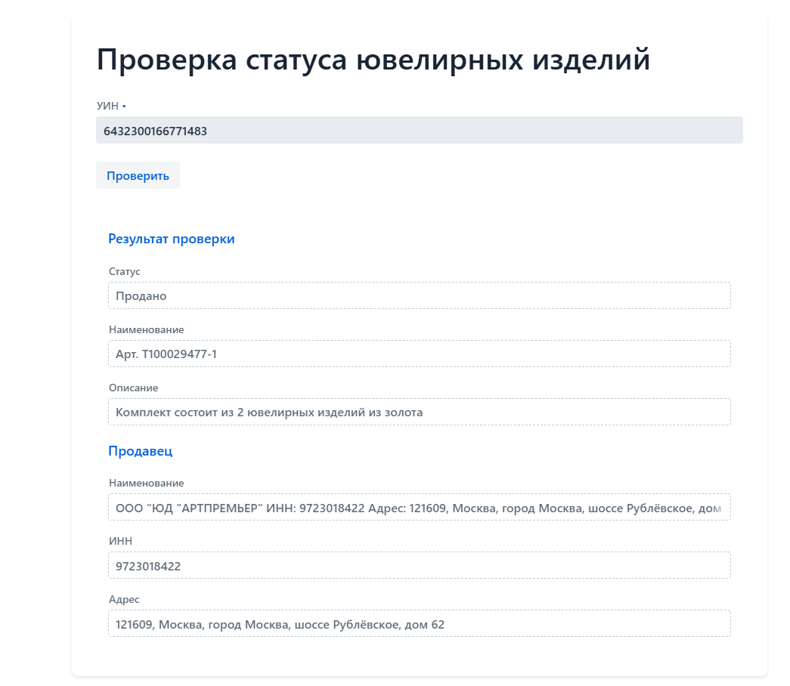

# uin_cheker
Проверка статусов ювелирных изделий по УИН в ГИИС ДМДК (продан/не продан)

## Описание проекта

Проект построен на базе spring на ЯП kotlin.
Предназначен для автоматизации проверки вывода из оборота ювелирных изделий в ГИИС ДМДК.

Доступен веб-интерфейс

Rest-API

## Для запуска необходимы 
- java 21
- opencv
- tesseract
