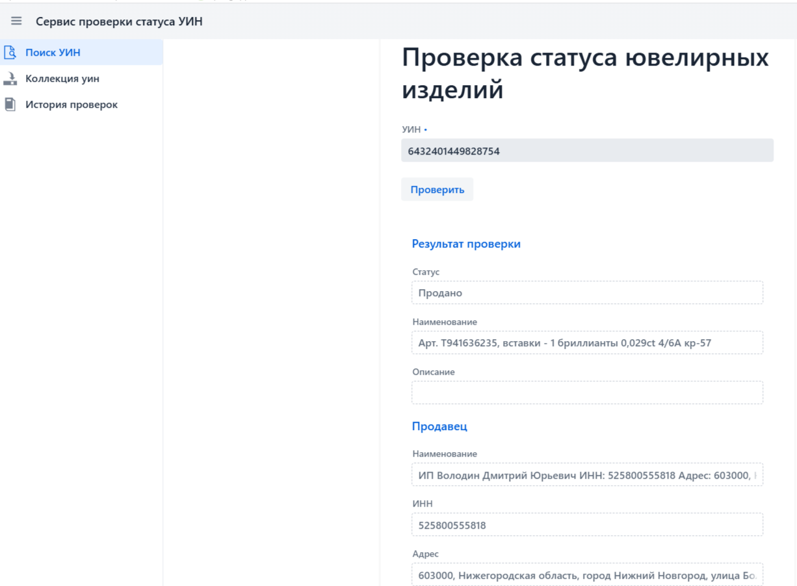
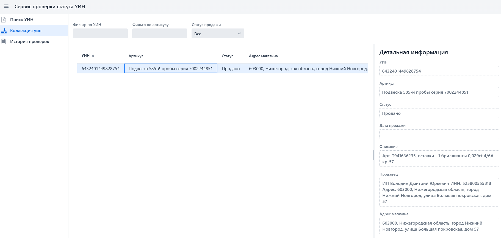
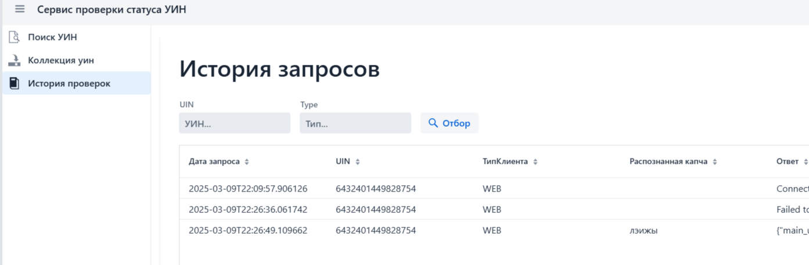
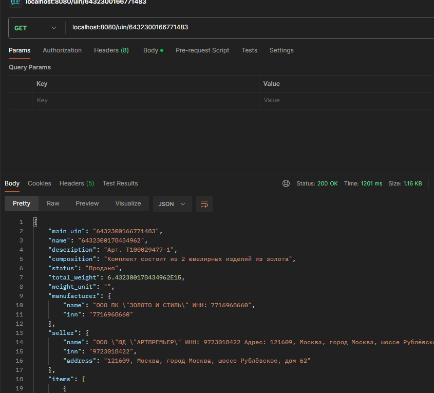

# uin_cheker
Проверка статусов ювелирных изделий по УИН в ГИИС ДМДК (продан/не продан)

## Описание проекта

Проект построен на базе spring на ЯП kotlin.
Предназначен для автоматизации проверки вывода из оборота ювелирных изделий в ГИИС ДМДК.

### Веб-интерфейс

### Проверка уина 

### коллекция проверенных 

### История запросов

### Rest-API

### handlers-api

***/api/v1/solve*** - ___POST___ - решение капчи. Капча в теле запроса в формате base64

***/uin/{ПРОВЕРЯЕМЫЙ УИН}*** - ___GET___ - выполняет проверку на внешнем ресурсе пробирной палаты. Возвращает json описания изделия в случае успеха 

## Для запуска необходимы 
- java 21
- opencv
- tesseract

